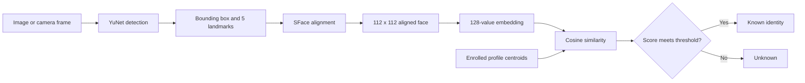

# Laptop Facial Recognition Pipeline

## Description

This project is a local, end-to-end facial recognition pipeline. It accepts an
image or webcam frame, detects faces with YuNet, aligns each face using five
facial landmarks, extracts a 128-value SFace embedding, and compares that
embedding with enrolled profiles using cosine similarity.



The pipeline performs these steps:

1. OpenCV captures a BGR image from a file or camera.
2. YuNet finds each face and returns a box, confidence score, and five
   landmarks. Large frames are resized to a maximum dimension of 640 pixels
   for inference, then coordinates are mapped back to the original frame.
3. SFace uses the landmarks to rotate, scale, and crop the face to `112 x 112`.
4. SFace converts the aligned face into a 128-dimensional embedding, which the
   project L2-normalizes.
5. Enrollment stores multiple embeddings and averages them into a normalized
   profile centroid.
6. Recognition calculates cosine similarity between a new embedding and every
   profile centroid. The best score is accepted when it reaches the threshold;
   otherwise the face is labeled `Unknown`.

The default detection threshold is `0.8`. The default recognition threshold is
`0.363`, based on the official OpenCV SFace example. Thresholds are starting
points rather than universal accuracy guarantees: camera quality, lighting,
pose, and enrollment samples can change the score distribution.

All processing runs locally. Downloaded models, personal profiles, images,
embeddings, and generated results are excluded from Git.

## Tool Choices

| Tool | Purpose | Reason for choosing it |
| --- | --- | --- |
| Python 3.12 | Application language | Provides readable code, fast iteration, and mature computer-vision libraries. The project supports Python 3.11 through 3.13. |
| OpenCV 4.14 | Camera capture, preprocessing, inference, and drawing | Runs locally on CPU and exposes detection, alignment, and embedding extraction as separate operations. |
| YuNet | Face detection | A small OpenCV model that returns boxes and the five landmarks needed for alignment. |
| SFace | Face alignment and embeddings | Integrates directly with YuNet landmarks and produces compact embeddings suitable for cosine matching. |
| NumPy | Vector normalization, storage, averaging, and similarity | Makes the embedding calculations explicit and easy to inspect. |
| Pytest | Automated testing | Tests each pipeline stage independently without requiring a live camera. |
| ONNX model files | Portable pretrained inference | Avoids training large neural networks while keeping inference local and reproducible. |

High-level packages such as DeepFace were not used because they would hide the
detection, alignment, embedding, storage, and matching stages that this project
is intended to demonstrate. The dlib-based `face_recognition` package was also
avoided because installation can be more difficult and it does not provide the
same direct OpenCV pipeline integration.

## Structure

```text
facial-recognition-pipeline/
├── data/                         # Private profiles and evaluation images
├── models/                       # Downloaded YuNet and SFace models
├── results/                      # Generated images and evaluation reports
├── src/face_pipeline/
│   ├── camera.py                 # Camera backend, startup, and frame reads
│   ├── detect.py                 # Detection CLI
│   ├── detector.py               # YuNet wrapper and drawing helpers
│   ├── download_models.py        # Model download and checksum verification
│   ├── embedder.py               # SFace alignment and feature extraction
│   ├── enroll.py                 # Image and webcam enrollment CLI
│   ├── evaluate.py               # Evaluation CLI
│   ├── evaluation.py             # Pair scoring and threshold metrics
│   ├── extract_embeddings.py     # Alignment and embedding inspection CLI
│   ├── matcher.py                # Cosine similarity and identity matching
│   ├── profiles.py               # Local profile persistence
│   └── recognize.py              # Image and webcam recognition CLI
├── tests/                        # Automated tests
├── .gitignore
├── pyproject.toml
└── README.md
```

An enrolled profile is stored locally as:

```text
data/profiles/<random-profile-id>/
├── profile.json                  # Name, model, date, and sample count
├── embeddings.npy               # Normalized embedding for each sample
└── samples/
    ├── sample_01.jpg             # Aligned enrollment face
    └── sample_02.jpg
```

Random profile IDs keep names out of directory paths. The entire `data/`
directory is ignored so biometric information is not committed.

## Setup

### 1. Clone the repository

```bash
git clone https://github.com/mattthewyeh/facial-recognition-pipeline.git
cd facial-recognition-pipeline
```

### 2. Create a virtual environment

Python 3.12 is recommended.

macOS or Linux:

```bash
python3.12 -m venv .venv
source .venv/bin/activate
```

Windows PowerShell:

```powershell
py -3.12 -m venv .venv
.venv\Scripts\Activate.ps1
```

### 3. Install the project

```bash
python -m pip install --upgrade pip
python -m pip install -e ".[dev]"
```

This creates the commands `download-face-models`, `detect-faces`,
`extract-face-embeddings`, `enroll-face`, `recognize-faces`, and
`evaluate-recognition`.

### 4. Download the models

```bash
download-face-models
```

The downloader retrieves the official YuNet and SFace ONNX files, verifies
their SHA-256 checksums, and stores them under `models/`. Running the command
again verifies existing files instead of downloading duplicates.

### 5. Allow camera access

On macOS, enable the application running the command under **System Settings >
Privacy & Security > Camera**, then fully restart that application. Camera
index `0` is typical, but `1` may be the built-in or preferred camera when
multiple devices are available.

## Usage

### Detect faces

From an image:

```bash
detect-faces \
  --image path/to/photo.jpg \
  --output results/detected.jpg \
  --no-display
```

From a camera:

```bash
detect-faces --camera 1
```

The display shows boxes, landmarks, confidence, face count, and FPS. Press `q`
to close it. Use `--score-threshold` to change the default `0.8` detection
threshold.

### Inspect alignment and embeddings

```bash
extract-face-embeddings \
  --image path/to/photo.jpg \
  --aligned-dir results/aligned \
  --output results/embeddings.npz
```

This prints each embedding's dimensions, norm, and detection confidence. It
also saves the aligned faces and an `.npz` file containing embeddings, boxes,
and confidence scores.

### Enroll a profile

From a camera:

```bash
enroll-face --name "Matthew" --camera 1 --samples 5
```

Click the camera window so it has keyboard focus. Show exactly one face, press
`Space` to capture each sample, and slightly vary angle, expression, distance,
or lighting. Press `q` to cancel without saving a profile.

From existing images:

```bash
enroll-face \
  --name "Matthew" \
  --image data/enrollment/matthew/front.jpg \
  --image data/enrollment/matthew/side.jpg \
  --image data/enrollment/matthew/darker.jpg
```

Each enrollment image must contain exactly one detected face. Multiple samples
produce a centroid that better represents modest appearance changes.

### Recognize faces

From a camera:

```bash
recognize-faces --camera 1
```

From an image:

```bash
recognize-faces \
  --image path/to/group-photo.jpg \
  --output results/recognized.jpg \
  --no-display
```

Known identities receive green boxes. Faces below the recognition threshold
receive red boxes and the label `Unknown`. A custom threshold can be tested
with `--threshold 0.50`; increasing it is stricter and may reduce false accepts
while increasing false rejects.

### Evaluate the pipeline

Organize a consent-based dataset with one directory per identity:

```text
data/evaluation/
├── person-one/
│   ├── front.jpg
│   └── side.jpg
└── person-two/
    ├── front.jpg
    └── side.jpg
```

Run:

```bash
evaluate-recognition \
  --dataset data/evaluation \
  --output results/evaluation.json
```

The evaluator reports genuine and impostor similarity ranges, false accepts,
false rejects, balanced accuracy, latency, FPS, and a suggested threshold for
the supplied images. Results from a small dataset are useful for debugging but
do not establish general accuracy or fairness.

## Tests

Run the complete suite from the repository root:

```bash
pytest -q
```

The 27 tests cover:

- YuNet output parsing, frame resizing, coordinate restoration, and drawing.
- Camera backend selection, startup retries, and read failures.
- SFace alignment, embedding normalization, and invalid vectors.
- Profile creation, reload, duplicate names, and sample validation.
- Cosine similarity, best-profile selection, and `Unknown` behavior.
- Genuine/impostor pair generation and threshold metrics.
- Real model inference on a blank frame when the models are installed.

The full flow was also manually tested on macOS: the camera opened through
AVFoundation, five samples created one local profile, the enrolled participant
was recognized, and an unenrolled consenting participant was labeled
`Unknown`. Profile images and embeddings remained under the ignored `data/`
directory.
